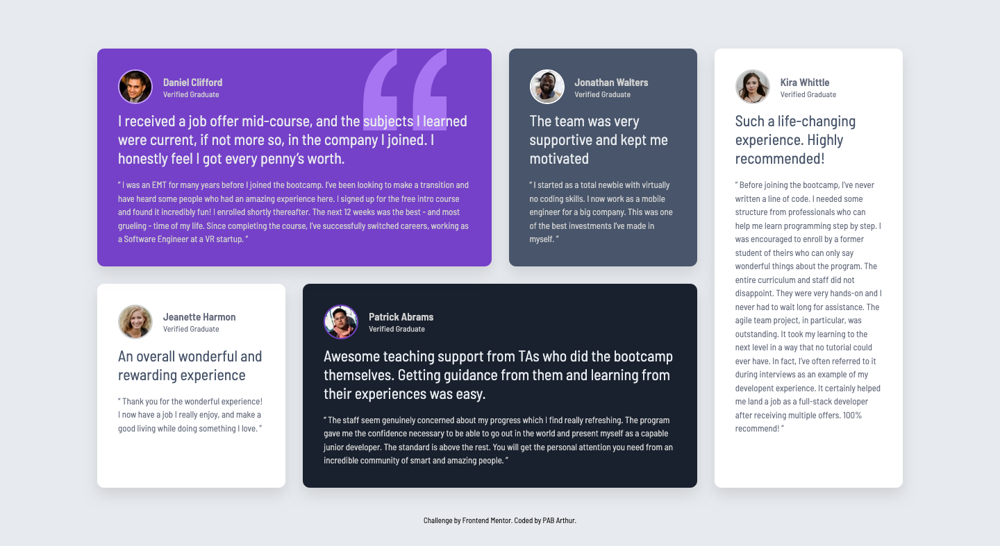

# Frontend Mentor - Testimonials grid section solution

This is a solution to the [Testimonials grid section challenge on Frontend Mentor](https://www.frontendmentor.io/challenges/testimonials-grid-section-Nnw6J7Un7). Frontend Mentor challenges help you improve your coding skills by building realistic projects.

## Table of contents

- [Overview](#overview)
  - [The challenge](#the-challenge)
  - [Screenshot](#screenshot)
  - [Links](#links)
- [My process](#my-process)
  - [Built with](#built-with)
  - [What I learned](#what-i-learned)
  - [Continued development](#continued-development)
  - [Useful resources](#useful-resources)
- [Author](#author)
- [Acknowledgments](#acknowledgments)

## Overview

### The challenge

Users should be able to:

- View the optimal layout for the site depending on their device's screen size

### Screenshot



### Links

- Solution URL: [Github](https://github.com/pabjunior/testimonials-grid-section)
- Live Site URL: [Netlify](https://papaya-cannoli-22fbdd.netlify.app/)

## My process

### Built with

- Semantic HTML5 markup
- CSS custom properties
- Flexbox
- CSS Grid
- Desktop-first workflow

### What I learned

During this challenge, I learned how to use CSS Grid to create complex responsive layouts. I also improved my skills in using media queries to adjust the design for different screen sizes.

Here are some code snippets that I'm proud of:

```css
.testimonial-grid {
  max-width: 1200px;
  margin: 40px auto;
  padding: 0 20px;
  display: grid;
  gap: 25px;
  grid-template-columns: repeat(4, 1fr);
  grid-template-rows: repeat(2, auto);
}

.testimonial-card-1 {
  background-color: var(--Purple-500);
  grid-column: span 2 / span 2;
  position: relative;
}

.testimonial-card-1::after {
  content: '';
  position: absolute;
  top: 0px;
  right: 65px;
  width: 120px;
  height: 120px;
  background-image: url('../images/bg-pattern-quotation.svg');
  background-size: contain;
  background-repeat: no-repeat;
}
```

### Continued development

I want to continue improving my skills in CSS Grid and Flexbox, as well as exploring more advanced responsive design techniques.

### Useful resources

- [CSS Grid Generator](https://cssgridgenerator.io/) - This tool helped me visualize and create the grid layout for this project. It was easy to use and saved me a lot of time.

## Author

- Frontend Mentor - [@pabjunior](https://www.frontendmentor.io/profile/pabjunior)
- Twitter - [@PAB_junior](https://x.com/PAB_junior)

## Acknowledgments

I would like to thank the Frontend Mentor community for providing such great challenges that help developers improve their skills.
